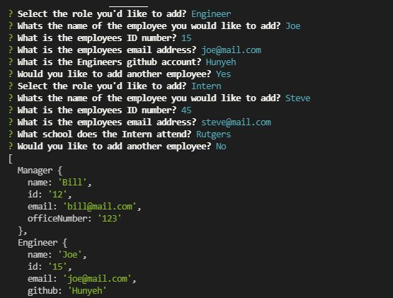

# Team-Profile-Generator

## Description
Allows the user to generate a a file displaying their team data using only the command line.

## Installation 
Go to my github account and clone my repo to your local computer.

## Usage
Simply follow the command line questions after entering "node index".
<!--  -->

## License
  GNU GPL v3

## Tests
Yes

## Video
[(https://drive.google.com/file/d/1xU_uLDpjQr4hmswfHnKpwqgv5wIFd42E/view?usp=sharing)]

## Questions
undefined
   
  Find me on GitHub 🏆: [Hunyeh](https://github.com/Hunyeh)
   
  ✉️ If any additional questions, email me @ : doringhunter@yahoo.com
  